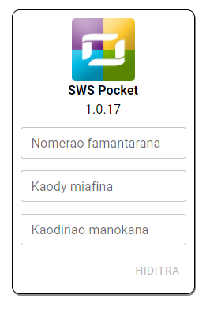
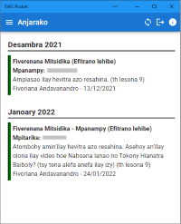

# TONGASOA 👋

In late 2021, we have created Scheduling Workbox System (SWS) team. Our main goal is to provide an easy-to-use application for Jehovah’s Witnesses, wether they are appointed brothers, publishers and students for Midweek Meeting.

## Application list

Here are the list of applications that we currently provide. Please note however, that they are not yet publicly available at this time:

### Secretary Tools - Report Organizer (ST-RO)
**Used by:** Secretary, to manage in a very efficient way the congregation reports

### Meeting Schedule Creator (MSC)  
**Used by:** Coordinator of the Body of Elders: to create schedule for midweek and weekend meetings

### Life and Ministry Meeting Overseer Assistant (LMM-OA)
**Used by:** Life and Ministry Meeting Overseer: to create student assignments schedule for midweek meeting

### SWS VIP
**Used by:** Appointed brothers: to handle various tasks that should be performed by brothers only according to their assignments

### SWS Pocket
**Used by:** Publishers, Students: to view meeting schedule, and submit monthly field report
#### Screenshots
 

## Technology

Web environment has been massively improving for the last few years. We would like to make the best of use of all these modern web technologies to deliver application that is fast, reliable and, more importantly, secure. All of these above applications are PWA capable.

## Supplemental tools

To better accomplish our mission, we have created additional tools to assist us:

### [JW EPUB Parser](https://github.com/sws2apps/jw-epub-parser#readme)
**Type:** module  
**Whats for:** To easily parse Meeting Workbook and Watchtower Study EPUB files from JW.ORG. This package is also availabe for general use, and can be downloaded from [npm](https://www.npmjs.com/package/jw-epub-parser)

### SWS API
**Type:** backend  
**Whats for:** A backend service that will handle some server actions that will be used accross all applications

## Contribute

Yes, all of our projects will be an open-source project on GitHub that everyone can contribute. We are more than happy to open our ❤️ for those who want to willingly help us to accomplish our mission.
